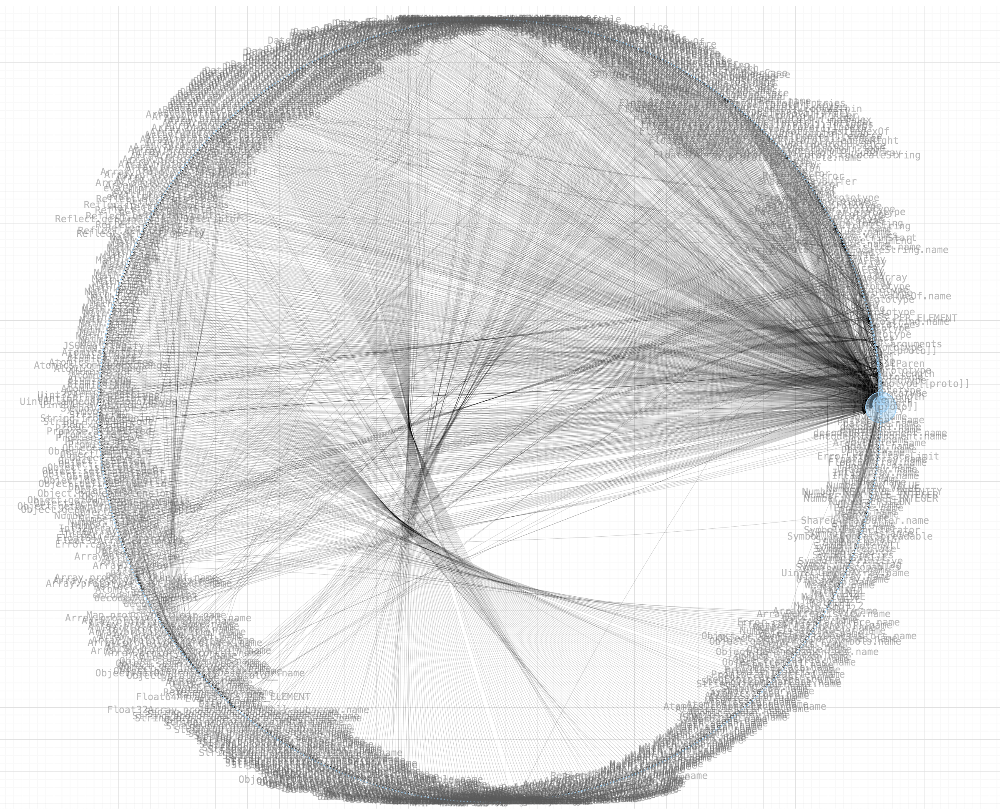

# 每周总结可以写在这里

## 作业一：找出 js 中所有的固有对象，并用关系图表示

### 思路
1. 根据 ECMAScript 标准中（18.The Global Object），梳理出标准中定义的所有 Global Object，共 50 个：
    - 3 个值：Infinity, NaN, undefined
    - 9 个函数：eval, isFinite, isNaN, parseFloat, parseInt, decodeURI, encodeURI, decodeURIComponent, encodeURIComponent
    - 34 个构造器：Array, ArrayBuffer, Boolean, DataView, Date, Error, EvalError, Float32Array, Float64Array, Function, Int8Array, Int16Array, Int32Array, Map, Number, Object, Promise, Proxy, RangeError, ReferenceError, RegExp, Set, SharedArrayBuffer, String, Symbol, SyntaxError, TypeError, Uint8Array, Uint8ClampedArray, Uint16Array, Uint32Array, URIError, WeakMap, WeakSet,
    - 4 个当作命名空间的对象：Atomics, JSON, Math, Reflect

2. 用迭代循环的方式找到上述 Global Object 属性/原型 上的对象
    - Objcet.getOwnPropertyNames：返回对象所有拥有的属性（包括不可枚举）的名称
    - Object.getPrototypeOf：返回对象原型

3. 用 G6 表示上述关系

- 代码：[object.html](./object.html)
- 最终效果：

## 作业二：随堂作业
